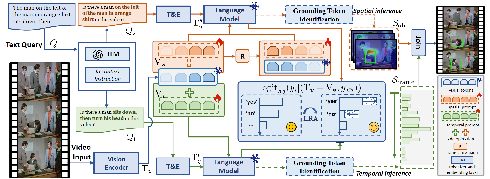

## Unleashing the Potential of Multimodal LLMs for Zero-Shot Spatio-Temporal Video Grounding, NeurIPS2025
---

<!-- This is official code of "Unleashing the Potential of Multimodal LLMs for Zero-Shot Spatio-Temporal Video Grounding" -->
<div align="center">

  [](https://arxiv.org/pdf/2509.15178)
  [](https://www.alphaxiv.org/abs/2509.15178)
  [](https://huggingface.co/papers/2509.15178)

</div>

## 📖 Introduction



This paper introduces a training-free framework for zero-shot spatio-temporal video grounding, utilizing off-the-shelf multimodal large language models (MLLMs) to precisely locate objects in video based on natural language queries. The method leverages inherent MLLM capabilities, outperforming existing zero-shot and many weakly-supervised methods, and achieving competitive results with some fully-supervised approaches across challenging benchmarks.


## 💭 Environment


## 📚 Data  and Models Preparation

###  Data Preparation

- Download the  generated proposals (about 100GB) for HC-STVG2 videos by SAM2 models at 🤗[hc-stvg2](https://huggingface.co/papers/2509.15178), which include 

The data path should be put in the folder `stvg/data` and look like this:

```
data/
└── hc-stvg2/
    └── annos/
        └── hcsvtg/
            ├── gpt4_decompose_actions/
            ├── gpt4_decompose_attr_action/
            ├── gpt4_decompose_attr_action.json
            ├── query.json
            ├── train.json
            ├── val_proc.json
            ├── val.json
            ├── better_track.json
            ├── llm_decompose_actions.py
            ├── llm_decompose_attr_action.py
            └── proc.py
```

Note that, we save the decomposed attribute and action query by `GPT4-o` in `gpt4_decompose_attr_action`.

### Models Preparation

- Download the Multi-modal LLMs (e.g., 🤗[LLaVA-NeXT-Video-7B-DPO](https://huggingface.co/lmms-lab/LLaVA-NeXT-Video-7B-DPO)). Put it in the `model_zoo/LLaVA-NeXT-Video-7B-DPO`.


## 💻 Get Started

Our method implementation is in the folder `stvg`.

The inference script `run_hcstvg2` is :

```shell
idx=-5
frames_thre=10
cfg='stvg/experiments/hcstvg2.yaml'
split='val'
model_path="model_zoo/LLaVA-NeXT-Video-7B-DPO"
PYTHONPATH="$PWD" CUDA_VISIBLE_DEVICES=0 python3 stvg/hc_llava_next_video.py \
    --cfg_file ${cfg} \
    --dataset_name 'hcstvg2' \
    --split ${split} \
    --model-path ${model_path} \
    --load_8bit True \
    --model_name 'LLaVA_NeXT_Video_7B' \
    --overwrite True \
    --mm_spatial_pool_stride 4 \
    --conv-mode vicuna_v1 \
    --mm_spatial_pool_mode "average" \
    --mm_newline_position "no_token" \
    --yes_id 3582 \
    --no_id 1217 \
    --s_lr 0.0 \
    --t_lr 0.0 \
    --ttt_epoch 0 \
    --temporal_thre 0.5 \
    --frames_thre ${frames_thre} \
    --llm_infer_mode 'base' \
    --img_size 336 \
    --token_idx ${idx} \
    --exp_comment "_token_${idx}" \
    INPUT.SAMPLE_FRAMES 20 \
    INPUT.RESOLUTION 336
```

Here, we assign which token by `idx` to achive the attention maps, and we can also implement flexible token choice based on the insight revealed in our work.

**Notes**: 

Important parameters introduction
  - `yes_id` and `no_id`: the token id corresponding to "yes" and "no" in `LLaVA-NeXT-Video`
  - `s_lr` and `t_lr` : learning rate for spatial and temporal prompt tuning
  - `ttt_epoch`: iterations of test-time tuning 
  - `INPUT.SAMPLE_FRAMES`: the frames number sampled from raw video
  - `INPUT.RESOLUTION`: spatial resolution of each frame
  - `mm_spatial_pool_stride`: downsampling visual tokens for efficient memory.
  - `frames_thre`: predicted interval for temporal grounding evaluation.


### ⚡Test-time tuning
  - In our implementation, we set `s_lr=8.0` and `t_lr=8.0`, and `ttt_epoch=2`, which is enough for most models.

  - ⚠️ Our Modifications

    - Current implementation is mostly based on the [LLaVA-Next](https://github.com/LLaVA-VL/LLaVA-NeXT). For Qwen2-VL, we can implement our method based on the [Transformers](https://github.com/huggingface/transformers).  Specially, we need to modify code properly for gradient optimization. 

    ```python
    # LLaVA-NeXT/llava/model/language_model/llava_llama.py
    # comment this line for gradient optimization
    # @torch.no_grad()
    def generate(
        self,
        inputs: Optional[torch.Tensor] = None,
        images: Optional[torch.Tensor] = None,
        image_sizes: Optional[torch.Tensor] = None,
        modalities: Optional[List[str]] = ["image"],
        **kwargs,
    ) -> Union[GenerateOutput, torch.LongTensor]:
        modalities = kwargs.pop("modalities", None) if "modalities" in kwargs and modalities is None else modalities
        
        # add the option for inputs_embeds (integrated spatial/temporal prompt) as input
        if "inputs_embeds" in kwargs:
            # xxxx
        else:
            # xxxx
        return super().generate(position_ids=position_ids, attention_mask=attention_mask, inputs_embeds=inputs_embeds, **kwargs)
    ```

## 🙌 Acknowledgements

- We thank the excellent open-source codebase like [LLaVA-Next](https://github.com/LLaVA-VL/LLaVA-NeXT), [Transformers](https://github.com/huggingface/transformers) and [SAM2](https://github.com/facebookresearch/sam2).
- We also thank the previous works including the [mllms_know](https://github.com/saccharomycetes/mllms_know/tree/main),  [ControlMLLM](https://github.com/mrwu-mac/ControlMLLM) and [CG-STVG](https://github.com/HengLan/CGSTVG) which inspire our work.


## 🍭 Citation

```
@article{yang2025unleashing,
  title={Unleashing the potential of multimodal llms for zero-shot spatio-temporal video grounding},
  author={Yang, Zaiquan and Liu, Yuhao and Hancke, Gerhard and Lau, Rynson WH},
  journal={arXiv preprint arXiv:2509.15178},
  year={2025}
}
```


